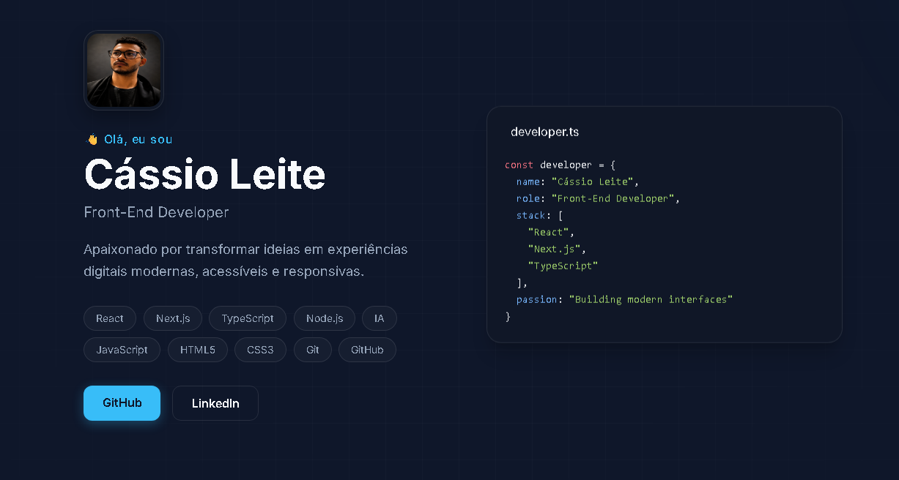

<!-- Banner -->

  

# 👋 Olá, eu sou Cássio Leite

### Front-End Developer • React • Next.js • TypeScript

Apaixonado por criar interfaces modernas, acessíveis e responsivas, transformando ideias em experiências digitais de alta qualidade.

*Crafting modern, accessible and high-performance web experiences.*

📍 Manhuaçu • Minas Gerais • Brasil

---

# 💡 Sobre mim

- 💻 Desenvolvedor Front-End focado em React e Next.js.
- 🚀 Busco criar aplicações rápidas, escaláveis e com excelente experiência do usuário.
- 📚 Estudando constantemente desenvolvimento Full Stack, arquitetura de software e boas práticas.
- 🎯 Objetivo: atuar como Desenvolvedor Front-End e construir produtos que gerem impacto real.

---

# 🛠 Tecnologias

### Front-End

### Back-End

### Ferramentas

---

# 🚀 Projetos em Destaque

## 🌤 Projeto Clima

Aplicação que consome uma API de previsão do tempo exibindo informações climáticas de qualquer cidade.

**Tecnologias**

- HTML
- CSS
- JavaScript
- API REST

🔗 Repositório:
https://github.com/cassio-leite/Projeto-clima

---

## ☕ Coffee Landing Page

Landing Page moderna desenvolvida para praticar UI responsiva e animações.

**Tecnologias**

- HTML
- CSS
- JavaScript

---

# 📊 Estatísticas

---

# 🔥 Sequência de contribuições

---

# 📚 Atualmente estudando

- Next.js
- React
- TypeScript
- Node.js
- Prisma ORM
- PostgreSQL
- Docker
- Clean Architecture
- Testes Automatizados

---

# 📫 Contato

---

### ⭐ Obrigado pela visita!

Se algum projeto chamou sua atenção, fique à vontade para explorá-lo ou entrar em contato.

